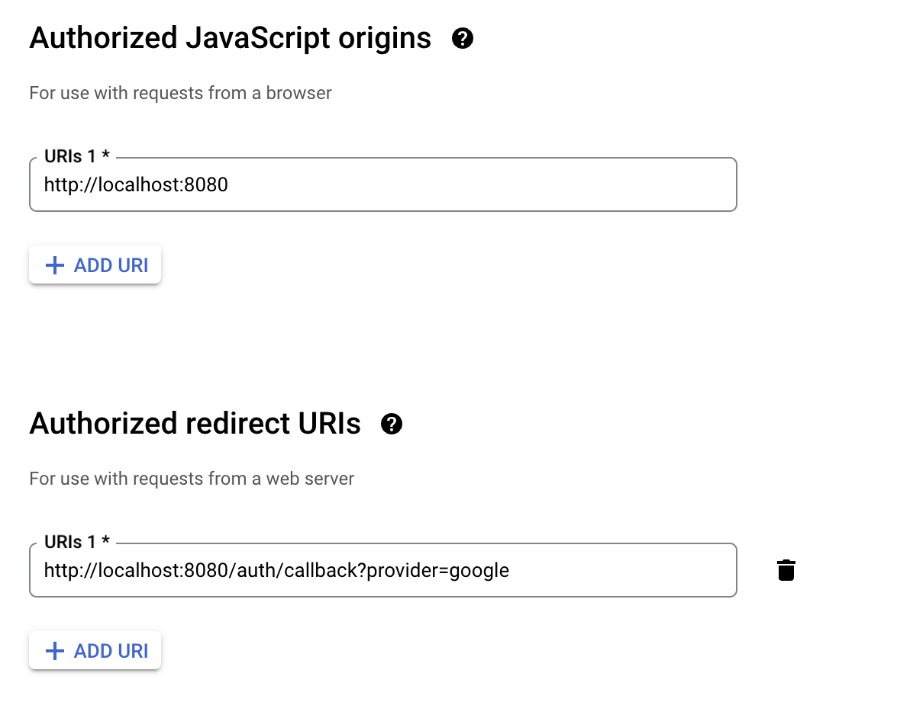

# Waltz
 
 Transfer your playlists from Spotify to Youtube Music written in Go. Self hosted.

## Usage

It's necessary to setup the API for Youtube and Spotify:

### Spotify

Create a new project on [developers.spotify.com](https://developer.spotify.com/). Make sure
the redirect URI is: `http://localhost:8080/auth/callback?provider=spotify`. Add the client id
and secret to the environment variables: `SPOTIFY_ID`, `SPOTIFY_SECRET`.

### YouTube

Create a new project on [console.cloud.google.com/](https://console.cloud.google.com/). Under
`API & Services -> Credentials` create a new OAuth Client Id, choose Web Application. Make
sure the urls are these: 

Under `API & Allowed Services` add `Youtube Data Api V3`. Add the client id and secret to
the environment variables: `GOOGLE_CLIENT_ID`, `GOOGLE_CLIENT_SECRET`

Then just run the project with `go run .` and access the app on `localhost:8080`.